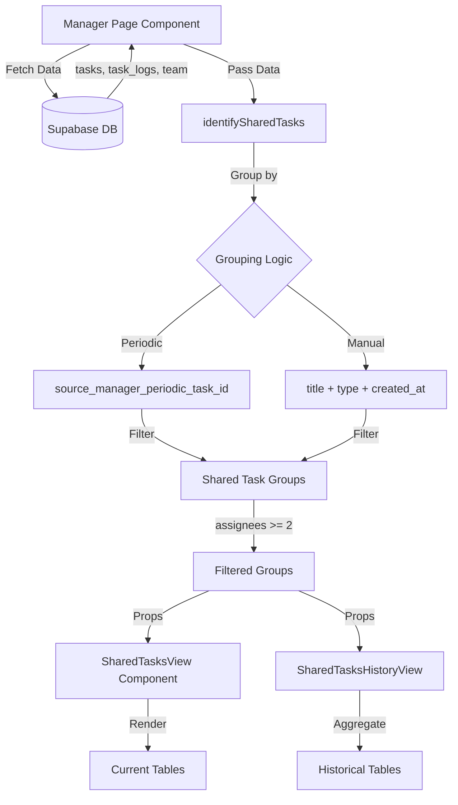

# Shared Tasks Feature

## Overview

The Shared Tasks feature provides managers with a comprehensive view of tasks assigned to multiple team members (2 or more). It displays task data in a matrix format where rows represent employees and columns represent tasks, showing status or numeric values in each cell.

**Implementation Date**: April 14, 2026

---

## What is a Shared Task?

A **Shared Task** is defined as any task (normal or periodic) that is assigned to **2 or more team members**. These tasks are identified by:

1. **Periodic Tasks**: Tasks with the same `source_manager_periodic_task_id` (created by periodic **materialization**: scheduled cron and/or instant-on-create; see [PERIODIC_TASKS_ARCHITECTURE.md](PERIODIC_TASKS_ARCHITECTURE.md))
2. **Manual Tasks**: Tasks created in bulk with the same `title`, `type`, and `created_at` date

---

## Key Features

### 1. Two Main Locations

#### Location 1: Manager Panel → Today's Task Tab
- **New Tab**: "Shared Tasks" (top-level)
- Shows current shared tasks due today
- **Existing Tab Modified**: "Today's Task" now has nested tabs:
  - "Regular Tasks" (existing content)
  - Contains the "Number of certificates" accordion

#### Location 2: Manager Panel → Task Verifications Tab
- **New Tabs Added**:
  - "Shared Tasks" - Current shared tasks view
  - "Shared History" - Historical shared tasks with date filter

### 2. Matrix Display Format

**Structure:**
- **Rows**: Employee names (all direct reports + sub-managers, sorted alphabetically)
- **Columns**: Shared task titles
- **Cells**: Status or numeric value

**Example:**
```
┌──────────────┬─────────────────┬─────────────────┬─────────────────┐
│ Employee     │ Update Records  │ Quality Check   │ Client Calls    │
├──────────────┼─────────────────┼─────────────────┼─────────────────┤
│ Alice Jones  │ Completed       │ 25              │ NA              │
│ Bob Smith    │ Pending         │ 30              │ Completed       │
│ Carol Davis  │ Not Submitted   │ NA              │ Pending         │
└──────────────┴─────────────────┴─────────────────┴─────────────────┘
```

### 3. Three Task Type Tables

Each view contains 3 collapsible accordions:
- **Daily Tasks**
- **Weekly Tasks**
- **Monthly Tasks**

### 4. Cell Value Display Logic

**Non-Numeric Tasks:**
- Show task status: "Completed", "Pending"
- If no submission: "Not Submitted"

**Numeric Tasks:**
- If `numeric_value` exists: Show number only (e.g., "25")
- If no numeric value but status exists: Show status
- If no submission: "Not Submitted"

**Not Assigned:**
- If task not assigned to employee: Show "NA"

### 5. Historical View with Aggregation

**Shared History Tab Features:**
- **Date Filter**: Single date picker
- **Numeric Tasks Only**: Only displays tasks with numeric values
- **Aggregation by Type**:
  - **Daily**: Shows numeric value for selected date
  - **Weekly**: Shows SUM of values for entire week containing selected date
  - **Monthly**: Shows SUM of values for entire month containing selected date

---

## Employee Scope

The feature displays:
- **Direct Reports**: Employees directly reporting to the manager
- **Sub-Managers**: Managers who report to this manager
- **Recursive Hierarchy**: Uses existing `get_all_subordinates()` RPC function

This ensures managers can see tasks for their entire team hierarchy.

---

## Technical Implementation

### Files Created

1. **`lib/utils/shared-tasks.ts`**
   - Core logic for identifying and grouping shared tasks
   - Cell value computation functions
   - Historical aggregation logic

2. **`components/manager/shared-tasks-view.tsx`**
   - Current shared tasks display component
   - 3 accordion tables (Daily/Weekly/Monthly)
   - Matrix format with employee rows and task columns

3. **`components/manager/shared-tasks-history-view.tsx`**
   - Historical shared tasks with date filter
   - Numeric tasks only
   - Aggregation by week/month

### Files Modified

1. **`app/org/[orgSlug]/manager/page.tsx`**
   - Added top-level "Shared Tasks" tab
   - Added nested tabs in "Today's Task" section
   - Added "Shared Tasks" and "Shared History" to Task Verifications
   - Integrated SharedTasksView and SharedTasksHistoryView components

---

## User Interface

### Navigation Structure

```
Manager Panel
├── Today's Task
│   └── [Nested Tabs]
│       └── Regular Tasks
│           └── Number of certificates (accordion)
├── Shared Tasks (NEW)
│   ├── Daily Tasks (accordion)
│   ├── Weekly Tasks (accordion)
│   └── Monthly Tasks (accordion)
├── Task Verifications
│   ├── Current
│   ├── History
│   ├── Shared Tasks (NEW)
│   └── Shared History (NEW)
├── Attendance
├── Attendance Report
├── Track Mistakes
├── Leaves
├── Team Members
└── Task Assignment
```

### Table Features

1. **Sticky First Column**: Employee names stay visible when scrolling horizontally
2. **Horizontal Scroll**: Handles many tasks gracefully
3. **Color Coding**:
   - Green: Completed
   - Yellow: Pending
   - Blue: Numeric values
   - Gray/Italic: NA or Not Submitted
4. **Tooltips**: Full task titles shown on hover for truncated text
5. **Collapsible Accordions**: Expand/collapse each task type section

---

## Data Flow



---

## Algorithm Details

### Identifying Shared Tasks

```typescript
function identifySharedTasks(tasks: Task[], minAssignees: number = 2) {
  // 1. Group tasks by identifier
  //    - Periodic: source_manager_periodic_task_id
  //    - Manual: title + type + created_at date
  
  // 2. Filter groups with assignees >= minAssignees
  
  // 3. Return SharedTaskGroup[] with metadata
}
```

### Cell Value Computation

```typescript
function getCellValue(taskGroup, employee, taskLogs, tasks, date?) {
  // 1. Check if employee is assigned
  if (!isAssigned) return "NA"
  
  // 2. Find employee's specific task instance
  // 3. Find relevant task log
  
  if (!taskLog) return "Not Submitted"
  
  // 4. For numeric tasks, return numeric_value if exists
  // 5. Otherwise return status
}
```

### Historical Aggregation

```typescript
function getHistoricalNumericValue(taskGroup, employee, taskLogs, tasks, targetDate) {
  // Daily: Return value for exact date
  
  // Weekly: 
  //   1. Calculate week start (Monday) from target date
  //   2. Calculate week end (Sunday)
  //   3. SUM all numeric_values in that range
  
  // Monthly:
  //   1. Get first and last day of month from target date
  //   2. SUM all numeric_values in that month
}
```

---

## Usage Examples

### Example 1: Manager Views Daily Shared Tasks

**Scenario**: Manager wants to see how team members are progressing on shared daily tasks.

**Steps**:
1. Navigate to Manager Panel
2. Click "Shared Tasks" tab
3. Expand "Daily Tasks" accordion
4. View matrix showing all employees and their task statuses

**Result**: See at a glance which employees completed tasks, which are pending, and who hasn't submitted yet.

### Example 2: Review Weekly Performance History

**Scenario**: Manager wants to review numeric task performance for last week.

**Steps**:
1. Navigate to Manager Panel → Task Verifications
2. Click "Shared History" tab
3. Select a date from last week (e.g., last Monday)
4. View "Weekly Tasks" accordion

**Result**: See total numeric values for each employee for that entire week.

### Example 3: Monthly Task Aggregation

**Scenario**: Review monthly certificate counts for last month.

**Steps**:
1. Go to Shared History tab
2. Select any date from last month
3. View "Monthly Tasks" accordion

**Result**: See total certificates issued by each employee for that entire month.

---

## Cell Value Display Rules

| Condition | Display Value | Color |
|-----------|--------------|-------|
| Task not assigned to employee | "NA" | Gray italic |
| No task log submitted | "Not Submitted" | Gray |
| Non-numeric completed | "Completed" | Green |
| Non-numeric pending | "Pending" | Yellow |
| Numeric value exists | Number only (e.g., "25") | Blue bold |
| Numeric task, no value, has status | Status text | Green/Yellow |

---

## Performance Considerations

### Client-Side Optimization
- **useMemo**: Computed shared task groups cached
- **Lazy Rendering**: Accordions only render when expanded
- **Horizontal Scroll**: Table uses sticky columns for performance
- **Sorted Once**: Employee list sorted once and memoized

### Data Volume Handling
- Works efficiently with 50+ employees
- Handles 20+ shared tasks per type
- Horizontal scroll prevents layout issues with many columns

### Query Optimization
- Uses existing data fetch (no additional queries)
- Filtering and grouping done client-side
- No database changes required

---

## Edge Cases & Handling

### 1. No Shared Tasks
**Display**: Empty state card with message
```
No Shared Tasks
Shared tasks are tasks assigned to 2 or more team members.
```

### 2. Task Assigned to Only One Person
**Behavior**: Not shown in shared tasks view (not considered "shared")

### 3. Employee Not Assigned to Task
**Display**: "NA" in that cell (grayed out, italic)

### 4. Task Submitted Without Numeric Value
**Display**: 
- If numeric task: Show status ("Completed", "Pending")
- If non-numeric: Show status

### 5. Historical Data Not Available
**Display**: "-" for empty cells in history view

### 6. Week/Month Spans Multiple Records
**Behavior**: Correctly sums all records in the time period

### 7. Many Tasks (Horizontal Overflow)
**Behavior**: Table scrolls horizontally, employee name column stays sticky

---

## Comparison with Other Views

| Feature | Today's Task (Regular) | Shared Tasks (Current) | Shared History |
|---------|----------------------|----------------------|----------------|
| **Format** | Grouped by employee | Matrix (employee × task) | Matrix (employee × task) |
| **Task Type** | Individual or shared | Shared only (2+ assignees) | Shared numeric only |
| **Time Filter** | Today only | Today only | Date picker |
| **Aggregation** | None | None | Week/Month sums |
| **Value Display** | Status + Number | Status or Number | Number only |
| **Employee Scope** | Direct reports | Direct + sub-managers | Direct + sub-managers |

---

## Troubleshooting

### Issue: Shared task not appearing

**Possible Causes**:
1. Task assigned to only 1 person
2. Task created on different date (for manual tasks)
3. Different task titles (case-sensitive)

**Solution**:
- Verify task has 2+ assignees
- Check task creation date and title match
- For periodic tasks, check `source_manager_periodic_task_id`

### Issue: "NA" showing for assigned employee

**Possible Causes**:
1. Task assignment record doesn't match grouping logic
2. Employee ID mismatch

**Solution**:
- Verify employee has a task record with matching title/type/date
- Check `assigned_to` field in database

### Issue: Historical aggregation incorrect

**Possible Causes**:
1. Date range calculation issue
2. Multiple task logs on same date

**Solution**:
- Verify date range for week/month
- Check if multiple submissions exist (should sum correctly)

### Issue: Empty in shared history

**Possible Causes**:
1. No numeric tasks
2. Date selected has no data

**Solution**:
- Shared history only shows numeric tasks
- Select different date with known submissions

---

## Future Enhancements

Potential improvements for future versions:

1. **Export to CSV**: Download shared task matrix as spreadsheet
2. **Custom Date Ranges**: Select date range instead of single date
3. **Filtering**: Filter by employee role, department, or status
4. **Sorting**: Sort columns by completion rate or average values
5. **Summary Row**: Show totals or averages at bottom
6. **Cell Click**: Open detailed task log on cell click
7. **Color Themes**: Customizable color schemes for statuses
8. **Notifications**: Alert manager when shared tasks have low completion rate

---

## Database Schema

**No changes required** - Uses existing schema:

```sql
-- Existing tables used:
tasks (id, title, type, assigned_to, source_manager_periodic_task_id, created_at, is_numeric_task, numeric_unit)
task_logs (task_id, user_id, date, status, numeric_value)
users (id, full_name, role, manager_id)
```

**Key Relationships:**
- Tasks grouped by `source_manager_periodic_task_id` OR `title + type + created_at`
- Task logs joined by `task_id` and `user_id`
- Employees fetched using `get_all_subordinates()` RPC

---

## API Reference

### Core Functions

#### `identifySharedTasks(tasks, minAssignees = 2)`
Groups tasks and identifies which are shared (assigned to 2+ people).

**Parameters:**
- `tasks: Task[]` - Array of task objects
- `minAssignees: number` - Minimum assignees to be considered shared (default: 2)

**Returns:** `SharedTaskGroup[]`

#### `getCellValue(taskGroup, employee, taskLogs, tasks, date?)`
Computes display value for a specific cell in the matrix.

**Parameters:**
- `taskGroup: SharedTaskGroup` - The shared task
- `employee: User` - The employee (row)
- `taskLogs: TaskLog[]` - All task logs
- `tasks: Task[]` - All tasks
- `date?: string` - Optional filter date (for current view)

**Returns:** `string` - Display value ("NA", "Completed", "25", etc.)

#### `getHistoricalNumericValue(taskGroup, employee, taskLogs, tasks, targetDate)`
Computes aggregated numeric value for historical view.

**Parameters:**
- `taskGroup: SharedTaskGroup` - The shared numeric task
- `employee: User` - The employee
- `taskLogs: TaskLog[]` - All task logs
- `tasks: Task[]` - All tasks
- `targetDate: string` - Date to aggregate around

**Returns:** `string` - Aggregated value or "NA" / "-"

---

## Testing Checklist

- [ ] Shared tasks identified correctly (2+ assignees)
- [ ] Periodic tasks grouped by `source_manager_periodic_task_id`
- [ ] Manual tasks grouped by title+type+created_at
- [ ] "NA" shown for unassigned employees
- [ ] "Not Submitted" shown when no log exists
- [ ] Numeric values display correctly
- [ ] Status text displays for non-numeric tasks
- [ ] Week aggregation calculates Monday-Sunday correctly
- [ ] Month aggregation calculates full month correctly
- [ ] Date filter in history view works
- [ ] Accordions expand/collapse properly
- [ ] Sticky employee column works on scroll
- [ ] Responsive on mobile (horizontal scroll enabled)
- [ ] Empty states display when no shared tasks
- [ ] Color coding matches specifications
- [ ] Nested tabs in Today's Task work correctly
- [ ] All 4 locations display shared tasks properly
- [ ] Performance with 50+ employees is acceptable
- [ ] No console errors or warnings

---

## Migration Requirements

**None** - This feature uses the existing database schema without any modifications.

---

## Security Considerations

### Row Level Security (RLS)
- Uses existing RLS policies on `tasks` and `task_logs`
- Only shows data for manager's subordinates (via `get_all_subordinates()`)
- No additional security concerns

### Data Access
- Managers can only view their team's shared tasks
- Uses same permissions as existing manager panel features

---

## Related Features

- **Periodic Task Assignment**: Shared tasks often come from periodic tasks
- **Task Verifications**: Managers approve/reject task submissions
- **Today's Task**: Shows individual task assignments
- **Recursive Manager Hierarchy**: Provides employee scope for shared tasks

---

## Support

For questions or issues:
1. Check troubleshooting section above
2. Verify shared task identification logic
3. Check browser console for errors
4. Ensure data is loaded correctly in manager panel

---

**Document Version**: 1.0  
**Last Updated**: April 14, 2026  
**Feature Status**: Production Ready
