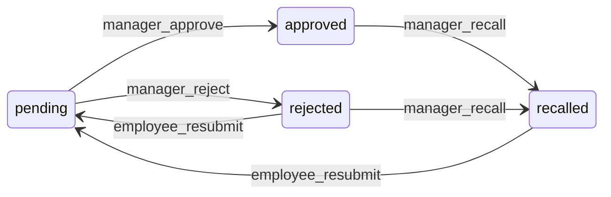

# Task verification, recall, and employee notifications

This document describes **manager approve / reject / recall**, **`verification_status` lifecycle**, **employee Tasks tab layout**, and **bell notifications** after the recall feature. It complements [`MANAGER_TASKS_TAB.md`](MANAGER_TASKS_TAB.md) (where things live in the UI) and the original consolidation plan.

## Database

**Migrations (two files — PostgreSQL requires this):** a new enum value cannot be used in the **same transaction** as `ALTER TYPE ... ADD VALUE` ([55P04](https://www.postgresql.org/docs/current/sql-altertype.html)).

1. [`20260426120000_task_recalled_notification_types.sql`](../supabase/migrations/20260426120000_task_recalled_notification_types.sql) — **`verification_status`**: add **`recalled`**; **`notification_type`**: add **`task_approved`**, **`task_recalled`**.
2. [`20260426120100_task_logs_employee_update_recalled_policy.sql`](../supabase/migrations/20260426120100_task_logs_employee_update_recalled_policy.sql) — replace policy **`Users can update their own unverified task_logs`** so employees may `UPDATE` when  
   `verification_status IN ('pending', 'rejected', 'recalled')`.

**Existing column:** `task_logs.manager_review_comment` stores the manager’s approve/reject comment and appended **recall** lines.

Deploy **both migrations** (in order) before app code that references `recalled` / the new notification types.

## State diagram

## Manager Panel — Tasks → Regular

| `verification_status` | Manager UI label (badge) | Actions |
|----------------------|---------------------------|---------|
| *(no log)* | Not Submitted | — |
| `pending` | Pending Approval | Expand row → **Comment:** / **Incomplete / note:** (no section title) → Approve / Reject |
| `approved` | Completed & verified (green) | **⋯** menu → **Recall** |
| `rejected` | Rejected (red) | **⋯** menu → **Recall** |
| `recalled` | Recalled (amber) | — (employee must resubmit) |

**Recall:** optional note in dialog; DB sets `verification_status = 'recalled'`, clears `verified_by` / `verified_at`, appends recall text to `manager_review_comment`. Inserts employee notification type **`task_recalled`** with `metadata.manager_comment` (full trail string) and `link` to org Tasks.

**Approve / reject:** updates log; inserts **`task_approved`** or **`task_rejected`** with message + **`metadata.manager_comment`** when present, `actionable: false`, `link` to org Tasks. Calls **`requestNotificationsBellRefresh()`** so the bell updates without relying only on Realtime.

**Code:** [`app/org/[orgSlug]/manager/page.tsx`](../app/org/[orgSlug]/manager/page.tsx) — `handleAction`, `handleRecallConfirm`, `todayTaskRows` status derivation, row **MoreVertical** menu.

## Employee — Tasks tab

- **Pending approvals** collapsible sections (daily / weekly / monthly) include tasks whose latest log is **`completed` and `verification_status === 'pending'`** only. **Rejected** and **recalled** rows appear in the **main** task tables with badges and **Resubmit / Re-enter** (same as reject flow).
- **Lifecycle:** `recalled` is handled like `rejected` for “must resubmit” (`getLifecycleState` → `submitted_rejected`).
- **Task table badges:** [`components/tasks/task-table.tsx`](../components/tasks/task-table.tsx) — **Recalled** (amber), **Verified** (green) for approved completed, **Rejected**, **Pending Approval**, etc.

**Code:** [`app/org/[orgSlug]/tasks/page.tsx`](../app/org/[orgSlug]/tasks/page.tsx) — `isPendingApprovalTask`, `getLifecycleState`.

**View Details** dialog (employee) still shows **`manager_review_comment`** from the log row.

## Notifications page & bell

- **Colors:** `task_approved` (emerald border), `task_recalled` (amber), existing types unchanged.
- **View comments:** [`getCommentModalPayload`](../app/org/[orgSlug]/notifications/page.tsx) reads **`metadata.manager_comment`** and/or **`metadata.employee_comment`**; combined payload titled **Comments** when both exist.

Unread count and mark-as-read (**CheckCheck**) behavior unchanged.

## Other code paths

| Area | Change |
|------|--------|
| [`lib/calendar/calendar-utils.ts`](../lib/calendar/calendar-utils.ts) | `IncompleteKind` + **`getIncompleteKind`** treat **`recalled`** like a distinct incomplete stripe label. |
| [`components/tasks/manager-review-dialog.tsx`](../components/tasks/manager-review-dialog.tsx) | If used: notifications use **`task_approved`** / **`task_rejected`** + metadata + `link` via `orgSlug`. |
| [`app/org/[orgSlug]/dashboard/page.tsx`](../app/org/[orgSlug]/dashboard/page.tsx) | Small badge styling for **`recalled`**. |
| [`lib/types/database.ts`](../lib/types/database.ts) | `VerificationStatus`, `NotificationType` unions. |

## Notification type cheat sheet

| `type` | Typical recipient | When |
|--------|-------------------|------|
| `task_verification` | Manager | Employee submitted for review (`task-log-dialog`, actionable metadata). |
| `task_approved` | Employee | Manager approved. |
| `task_rejected` | Employee | Manager rejected. |
| `task_recalled` | Employee | Manager recalled after approve/reject. |

## Related docs

- [`MANAGER_TASKS_TAB.md`](MANAGER_TASKS_TAB.md) — sidebar Tasks, Regular / Shared / History, approval UX.
- [`ACCORDION_DETAILS_CHEVRON.md`](ACCORDION_DETAILS_CHEVRON.md) — disclosure accordion pattern.
- [`NOTIFICATIONS_AND_BELL.md`](NOTIFICATIONS_AND_BELL.md) — bell refresh and Realtime (if present).
